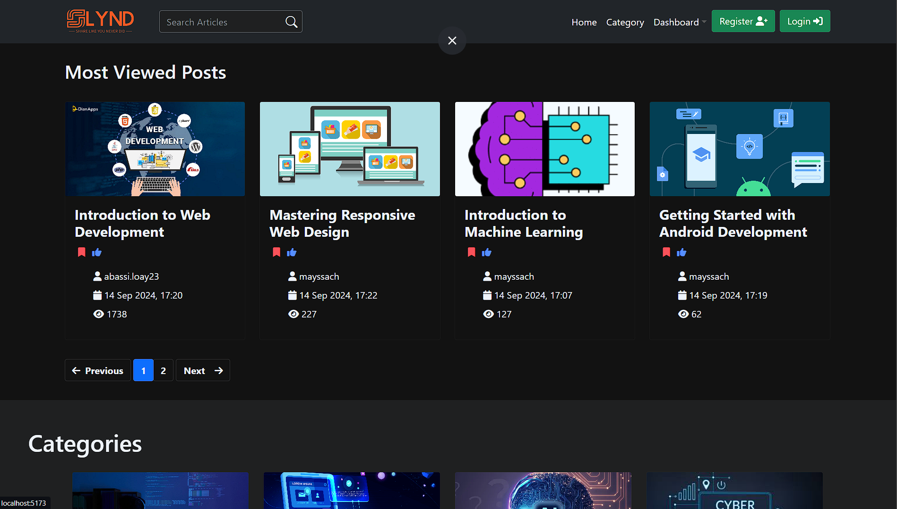
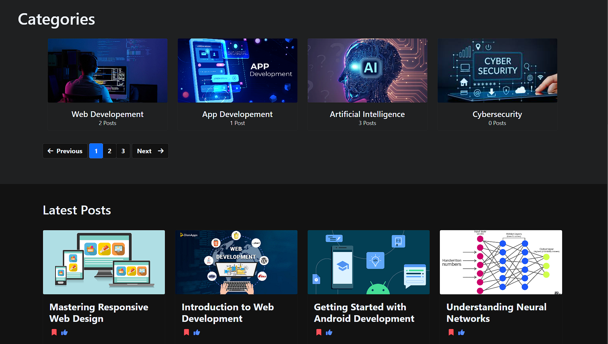
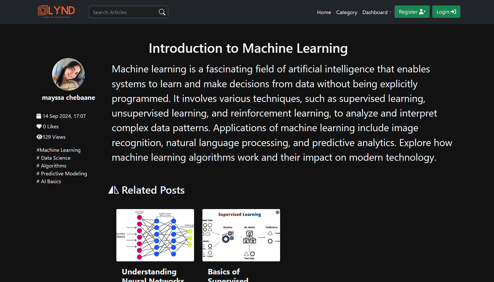
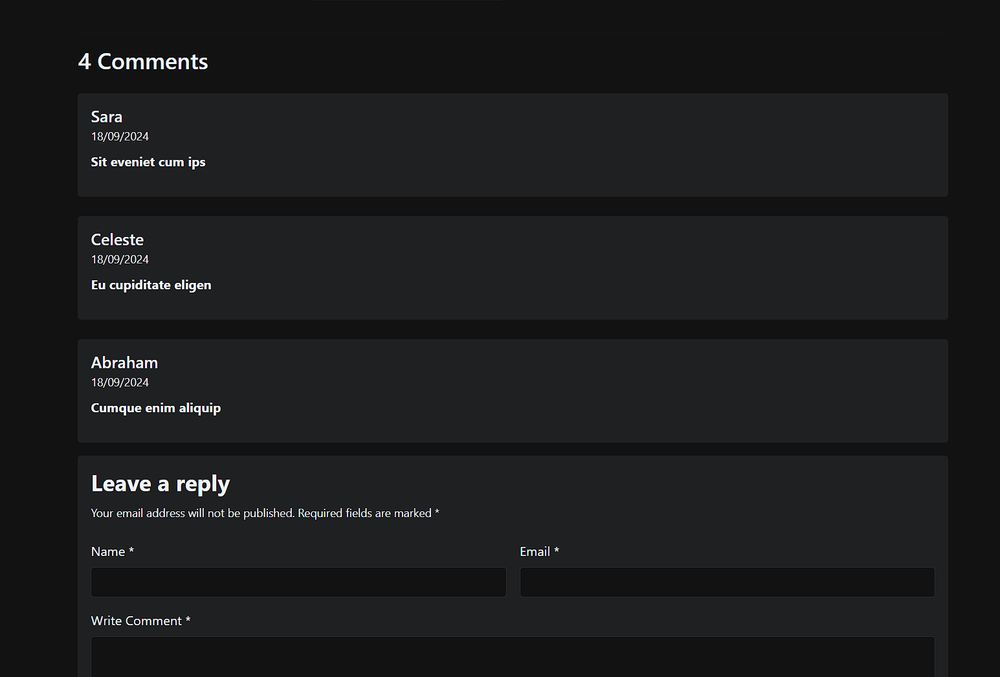

# SLYND - ALX Portfolio Project

# My Coding Adventure

In 2019, I started coding, and by 2024, I decided to tackle a blog app using Django and React. Why? Because why not! 😅

Building SLYND was a wild ride. The most epic challenge? Debugging a feature to fetch related posts—spent 5 hours on 10 lines of code🤦‍♂️

I stumbled, I searched, and I asked AI for help (thank you, tech gods!). But in the end, I had a blog app that actually works(i think). 🎉

## I. Frameworks

1. Django - Backend framework for building the server-side of the application.
2. React - Frontend library for building user interfaces.

## II. Programming Languages

1. Python - Used for the backend, handling server logic, database interaction, and APIs.
2. JavaScript - Used for the frontend with React to create dynamic web pages.

## III. Project Description

SLYND is a blog application that allows users to:

- Create, edit, and delete blog posts.
- View posts created by other users.
- Comment on posts.
- Like and share posts.
- Search for posts by title or content.

## IV. Features

1. User authentication (signup, login, logout).
2. Blog post creation with rich text support.
3. Commenting and interaction (likes, shares).
4. Responsive design with React for an optimal user experience on any device.
5. Backend API built with Django for managing posts, users, and interactions.

## V. Database

- **sqlite**: Used to store user data, blog posts, and interactions (comments, likes).

## VI. Setup Instructions

1. Clone the repository:
   git clone <https://github.com/LoayAbassi/SLYND>
2. Install backend dependencies:
   pip install -r requirements.txt

3. Install frontend dependencies
   cd frontend
   npm install
4. run backend server
   python manage.py runserver
5. run react dvelopement server
   npm start

## VII. Authors

Loay Abassi
Let me know if you need any adjustments :)

# Screenshots

### 1

### 2

### 3

### 4

